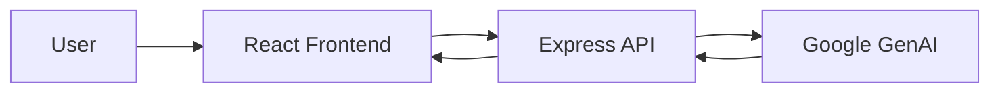

# 🚀 Synergy AI

> An intelligent full-stack AI conversational platform powered by Google GenAI.

### 🌐 Live Demo
[🚀 OPEN LIVE DEMO →](https://synergy-ai-weld.vercel.app) | [💻 Source Code](https://github.com/YUVA-2329/synergy-ai) 

---

## 🎬 Demo & 📸 Screenshots


*(Project preview and screenshots demonstrating the core user experience)*

---

## 🧠 About the Project

This project was built to solve real-world challenges through modern web technologies and advanced engineering. By combining scalable architecture with an intuitive user interface, Synergy AI provides an exceptional user experience while maintaining high performance and security.

### ✨ Key Features
- ⚡ Real-time AI processing
- 🤖 Google GenAI integration
- 🎨 Cinematic modern UI with Framer Motion
- 📱 Fully responsive interface
- 🗄️ Persistent chat state management

---

## 🛠️ Tech Stack

**Frontend:** React, TypeScript, Tailwind CSS, Framer Motion
**Backend:** Node.js, Express, Vite
**AI/ML:** Google GenAI API

---

## 🏗️ Architecture



---

## ⚙️ How It Works

1. User enters a query into the chat interface.
2. The frontend sends the request to the Express backend.
3. The backend processes the prompt and communicates with the Google GenAI API.
4. AI response is streamed back to the frontend and rendered in real-time.

---

## 🚀 Getting Started

### Installation

```bash
git clone https://github.com/YUVA-2329/synergy-ai.git
cd synergy-ai
npm install
npm run dev
```

### Environment Variables
Create a `.env` file in the root directory:
```env
PORT=3000
GEMINI_API_KEY=YOUR_API_KEY_HERE
```

---

## 📁 Project Structure

```text
project/
├── src/
│   ├── components/
│   ├── api/
│   └── main.tsx
├── server.ts
└── package.json
```

---

## 🛣️ Roadmap

- [x] Core AI chat functionality
- [x] Responsive UI
- [ ] Advanced analytics dashboard
- [ ] Multi-model support

---

## 📊 Status

🟢 Active Development

---

## 👨‍💻 Author

**Yuva Kishore Peta**  
GitHub: [YUVA-2329](https://github.com/YUVA-2329)
